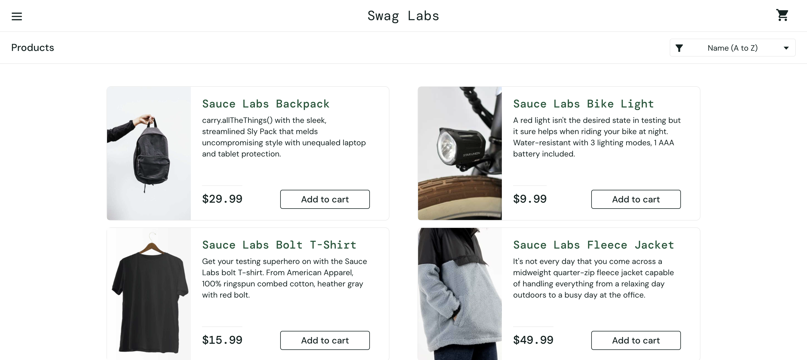

## 📸 Automated Execution Documentation

The framework is engineered with a custom post-test lifecycle hook inside `conftest.py`. At the conclusion of every test case execution, the engine automatically captures the current visual state of the browser and logs it to a structured `/screenshots` directory for audit trailing.

### Core Login Verification (TC-001)
> Automatically capturing successful landing page state transitions:
>

### Dynamic Dashboard Network Asset Auditing (TC-009)
> Proving backend link stability alongside UI responsiveness:
>
